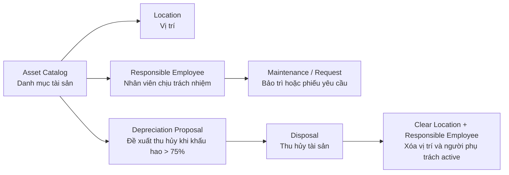

# Business Flow Diagram

`BFD` là Business Flow Diagram: sơ đồ luồng nghiệp vụ. Bản này cố tình đơn giản để người non-tech nhìn vào vẫn hiểu hệ thống làm gì.

## Luồng Tổng Thể

## Cách Kể Cho Khách

1. Công ty tạo tài sản trong `Asset Catalog`.
2. Mỗi tài sản được đặt tại một `Location`.
3. Nếu tài sản có người theo dõi, hệ thống gắn một `Responsible Employee`.
4. Nhân viên phụ trách có thể gửi request khi tài sản gặp sự cố.
5. Technician xử lý maintenance và cập nhật kết quả.
6. Hệ thống tính depreciation để đưa ra danh sách đề xuất thu hủy khi vượt `75%`.
7. Khi thu hủy thật, tài sản chuyển sang `retired`, không còn vị trí active và không còn người phụ trách active.

## Vì Sao Dễ Trình Bày

- Chỉ có một trung tâm là `Asset`.
- `Location` trả lời "tài sản ở đâu".
- `Responsible Employee` trả lời "ai chịu trách nhiệm".
- `Depreciation Proposal` chỉ là danh sách gợi ý, không tự xóa tài sản.
- `Disposal` là bước chốt vòng đời tài sản.
