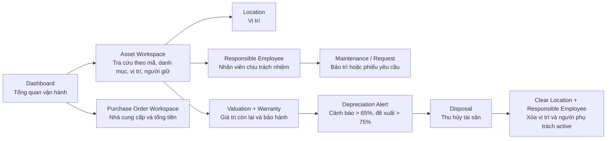

# Business Flow Diagram

`BFD` là Business Flow Diagram: sơ đồ luồng nghiệp vụ. Bản này cố tình đơn giản để người non-tech nhìn vào vẫn hiểu hệ thống làm gì.

## Luồng Tổng Thể

```mermaid
flowchart LR
    A["Dashboard<br/>Tổng quan vận hành"] --> B["Asset Workspace<br/>Tra cứu theo mã, danh mục, vị trí, người giữ"]
    B --> C["Location<br/>Vị trí"]
    B --> D["Responsible Employee<br/>Nhân viên chịu trách nhiệm"]
    D --> E["Maintenance / Request<br/>Bảo trì hoặc phiếu yêu cầu"]
    B --> F["Valuation + Warranty<br/>Giá trị còn lại và bảo hành"]
    F --> G["Depreciation Alert<br/>Cảnh báo > 65%, đề xuất > 75%"]
    A --> H["Purchase Order Workspace<br/>Nhà cung cấp và tổng tiền"]
    G --> I["Disposal<br/>Thu hủy tài sản"]
    I --> J["Clear Location + Responsible Employee<br/>Xóa vị trí và người phụ trách active"]
```

## Cách Kể Cho Khách

1. Manager hoặc technician mở `Dashboard` để nhìn tổng giá trị tồn kho, thiết bị gián đoạn và cảnh báo khấu hao.
2. Từ thanh tìm kiếm hoặc dashboard, người vận hành mở `Asset Workspace` để tra cứu đúng tài sản.
3. Mỗi tài sản được gắn với một `Location` và có thể có một `Responsible Employee` đang active.
4. Từ màn hình asset, người vận hành có thể bàn giao, thu hồi hoặc mở `Maintenance Workspace`.
5. Nhân viên phụ trách gửi request khi tài sản gặp sự cố hoặc cần vật tư.
6. Hệ thống tính valuation, warranty và depreciation để đưa ra danh sách cần theo dõi hoặc đề xuất thu hủy khi vượt `75%`.
7. Nếu cần mua thêm thiết bị, manager hoặc technician tạo `Purchase Order` theo nhà cung cấp.
8. Khi thu hủy thật, tài sản chuyển sang `retired`, không còn vị trí active và không còn người phụ trách active.

## Vì Sao Dễ Trình Bày

- Chỉ có một trung tâm là `Asset` và một workspace tra cứu để thao tác nhanh.
- `Location` trả lời "tài sản ở đâu".
- `Responsible Employee` trả lời "ai chịu trách nhiệm".
- `Dashboard` gom valuation, hàng đợi và cảnh báo để ra quyết định.
- `Depreciation Alert` chỉ là danh sách gợi ý, không tự xóa tài sản.
- `Disposal` là bước chốt vòng đời tài sản.
