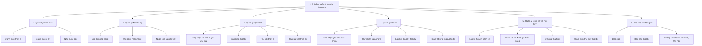

# Business Flow Diagram

`BFD` là sơ đồ chức năng nghiệp vụ cấp cao của hệ thống Mesoco. Sidebar web chỉ hiển thị chức năng vận hành, không hiển thị BFD như một module người dùng.

## 6 Phân Hệ Chính

```mermaid
flowchart TD
    A["Hệ thống quản lý thiết bị Mesoco"]
    A --> B["1. Quản lý danh mục"]
    A --> C["2. Quản lý đơn hàng"]
    A --> D["3. Quản lý vận hành"]
    A --> E["4. Quản lý bảo trì"]
    A --> F["5. Quản lý kiểm kê và thu hủy"]
    A --> G["6. Báo cáo và thống kê"]

    B --> B1["Danh mục thiết bị"]
    B --> B2["Danh mục vị trí"]
    B --> B3["Nhà cung cấp"]

    C --> C1["Lập đơn đặt hàng"]
    C --> C2["Theo dõi nhận hàng"]
    C --> C3["Nhập kho và gắn QR"]

    D --> D1["Tiếp nhận và phê duyệt yêu cầu"]
    D --> D2["Bàn giao thiết bị"]
    D --> D3["Thu hồi thiết bị"]
    D --> D4["Tra cứu QR thiết bị"]

    E --> E1["Tiếp nhận yêu cầu sửa chữa"]
    E --> E2["Thực hiện sửa chữa"]
    E --> E3["Lập lịch bảo trì định kỳ"]
    E --> E4["Hoàn tất sửa chữa/bảo trì"]

    F --> F1["Lập kế hoạch kiểm kê"]
    F --> F2["Kiểm kê và đánh giá tình trạng"]
    F --> F3["Đề xuất thu hủy"]
    F --> F4["Thực hiện thu hủy thiết bị"]

    G --> G1["Báo cáo"]
    G --> G2["Báo cáo thiết bị"]
    G --> G3["Thống kê bảo trì, kiểm kê, thu hồi"]
```

## Mapping Sang Web

| BFD | Màn hình trong sidebar |
| --- | --- |
| Tổng quan | Menu chính đầu sidebar, không nằm trong Báo cáo & thống kê |
| Quản lý danh mục | Danh mục thiết bị, Danh mục vị trí, Nhà cung cấp |
| Quản lý đơn hàng | Đơn hàng |
| Quản lý vận hành | Quét QR thiết bị, Phiếu yêu cầu, Duyệt yêu cầu, Bàn giao / Thu hồi |
| Quản lý bảo trì | Bảo trì & Sửa chữa |
| Quản lý kiểm kê và thu hủy | Kiểm kê định kỳ, Thu hủy |
| Quản lý hồ sơ | Hồ sơ thiết bị, Hồ sơ bàn giao, Hồ sơ thu hồi, Hồ sơ kiểm kê, Hồ sơ bảo trì |
| Báo cáo và thống kê | Báo cáo & thống kê |

## Quy Ước Diễn Giải

1. `Location` trả lời thiết bị đang ở đâu.
2. `Assignment` trả lời ai đang chịu trách nhiệm sử dụng thiết bị.
3. QR là cổng tra cứu nhanh theo quyền: nhân viên thấy thông tin cơ bản, kỹ thuật viên thấy thêm bảo trì/khấu hao, quản lý thấy toàn bộ.
4. Khấu hao vượt `75%` chỉ tạo cảnh báo hoặc đề xuất thu hủy; hệ thống không tự chuyển thiết bị sang đã thu hủy.
5. Thu hủy là bước chốt vòng đời thiết bị và cần thao tác xác nhận của quản lý hoặc người vận hành được phân quyền.
