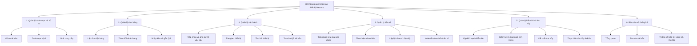

# Business Flow Diagram

`BFD` là sơ đồ chức năng nghiệp vụ cấp cao của hệ thống Mesoco. Sidebar trong web đang bám theo 6 phân hệ lớn dưới đây; các màn hình nhỏ được đặt vào submenu tương ứng.

## 6 Phân Hệ Chính

```mermaid
flowchart TD
    A["Hệ thống quản lý tài sản thiết bị Mesoco"]
    A --> B["1. Quản lý danh mục và hồ sơ"]
    A --> C["2. Quản lý đơn hàng"]
    A --> D["3. Quản lý vận hành"]
    A --> E["4. Quản lý bảo trì"]
    A --> F["5. Quản lý kiểm kê và thu hủy"]
    A --> G["6. Báo cáo và thống kê"]

    B --> B1["Hồ sơ tài sản"]
    B --> B2["Danh mục vị trí"]
    B --> B3["Nhà cung cấp"]

    C --> C1["Lập đơn đặt hàng"]
    C --> C2["Theo dõi nhận hàng"]
    C --> C3["Nhập kho và gắn QR"]

    D --> D1["Tiếp nhận và phê duyệt yêu cầu"]
    D --> D2["Bàn giao thiết bị"]
    D --> D3["Thu hồi thiết bị"]
    D --> D4["Tra cứu QR tài sản"]

    E --> E1["Tiếp nhận yêu cầu sửa chữa"]
    E --> E2["Thực hiện sửa chữa"]
    E --> E3["Lập lịch bảo trì định kỳ"]
    E --> E4["Hoàn tất sửa chữa/bảo trì"]

    F --> F1["Lập kế hoạch kiểm kê"]
    F --> F2["Kiểm kê và đánh giá tình trạng"]
    F --> F3["Đề xuất thu hủy"]
    F --> F4["Thực hiện thu hủy thiết bị"]

    G --> G1["Tổng quan"]
    G --> G2["Báo cáo tài sản"]
    G --> G3["Thống kê bảo trì, kiểm kê, thu hồi"]
```

## Mapping Sang Web

| BFD | Màn hình trong sidebar |
| --- | --- |
| Quản lý danh mục và hồ sơ | Danh mục tài sản, Danh mục vị trí, Nhà cung cấp |
| Quản lý đơn hàng | Đơn hàng |
| Quản lý vận hành | Quét QR tài sản, Phiếu yêu cầu, Duyệt yêu cầu, Bàn giao / Thu hồi |
| Quản lý bảo trì | Bảo trì & Sửa chữa |
| Quản lý kiểm kê và thu hủy | Kiểm kê định kỳ, Thu hủy |
| Báo cáo và thống kê | Tổng quan, Báo cáo & thống kê |

## Quy Ước Diễn Giải

1. `Location` trả lời tài sản đang ở đâu.
2. `Assignment` trả lời ai đang chịu trách nhiệm sử dụng tài sản.
3. QR là cổng tra cứu nhanh theo quyền: nhân viên thấy thông tin cơ bản, kỹ thuật viên thấy thêm bảo trì/khấu hao, quản lý thấy toàn bộ.
4. Khấu hao vượt `75%` chỉ tạo cảnh báo hoặc đề xuất thu hủy; hệ thống không tự chuyển tài sản sang đã thu hủy.
5. Thu hủy là bước chốt vòng đời tài sản và cần thao tác xác nhận của quản lý hoặc người vận hành được phân quyền.
