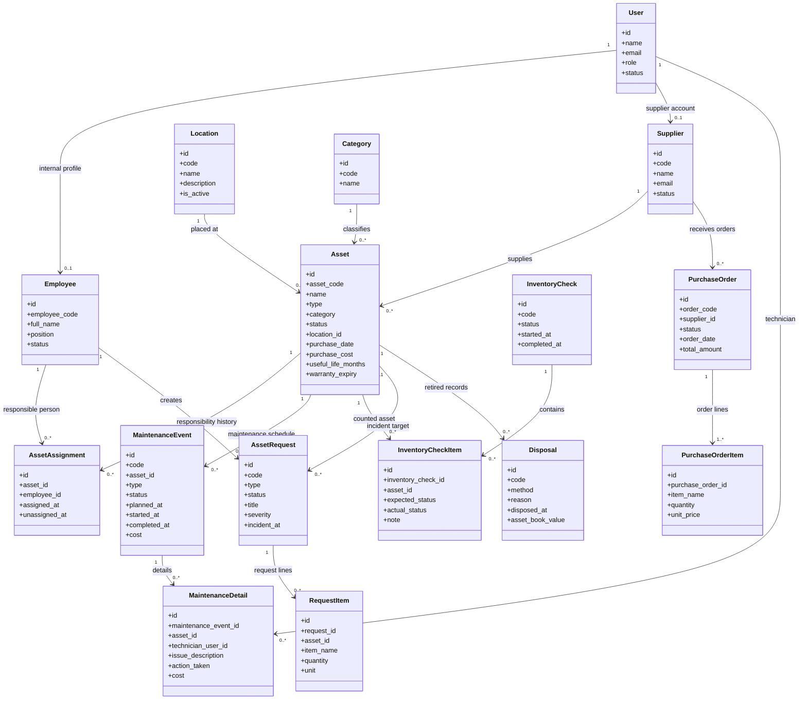

# Class Diagram

Diagram này dùng cho báo cáo/luận văn. Mục tiêu là mô tả nghiệp vụ chính, không liệt kê mọi field kỹ thuật.

## Cách Đọc Nhanh

- `Asset` là trung tâm hệ thống.
- `Location` trả lời câu hỏi: tài sản đang ở đâu.
- `AssetAssignment` trả lời câu hỏi: nhân viên nào đang chịu trách nhiệm.
- `MaintenanceEvent` là phiếu bảo trì; `MaintenanceDetail` là dòng chi tiết xử lý.
- `InventoryCheck` và `InventoryCheckItem` phục vụ kiểm kê.
- `PurchaseOrder` và `Supplier` phục vụ mua sắm thiết bị/vật tư.
- `Disposal` ghi nhận tài sản bị thu hủy; sau bước này asset không còn location active và không còn responsible employee active.
