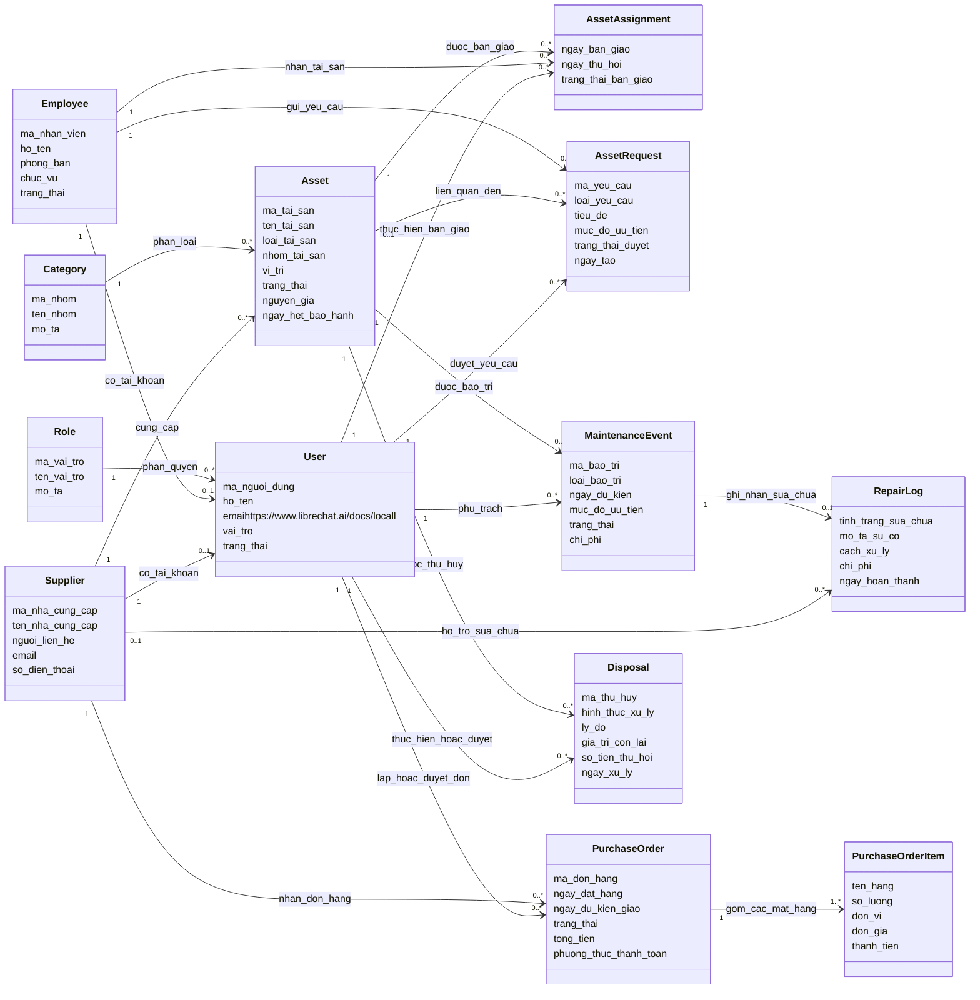

# Class Diagram

Sơ đồ này được rút gọn để dùng trong báo cáo nghiệp vụ. Mục tiêu là thể hiện các đối tượng chính của hệ thống và mối quan hệ giữa chúng, không đi sâu vào chi tiết lập trình.

## Ghi chú đọc sơ đồ

- `1` nghĩa là một bản ghi duy nhất.
- `0..1` nghĩa là có thể có hoặc không có.
- `0..*` nghĩa là có thể có nhiều bản ghi.
- Sơ đồ chỉ giữ các lớp quan trọng cho báo cáo nghiệp vụ. Các lớp kỹ thuật như mã QR, lịch sử thao tác, sinh mã tự động không được đưa vào để tránh làm rối sơ đồ.
