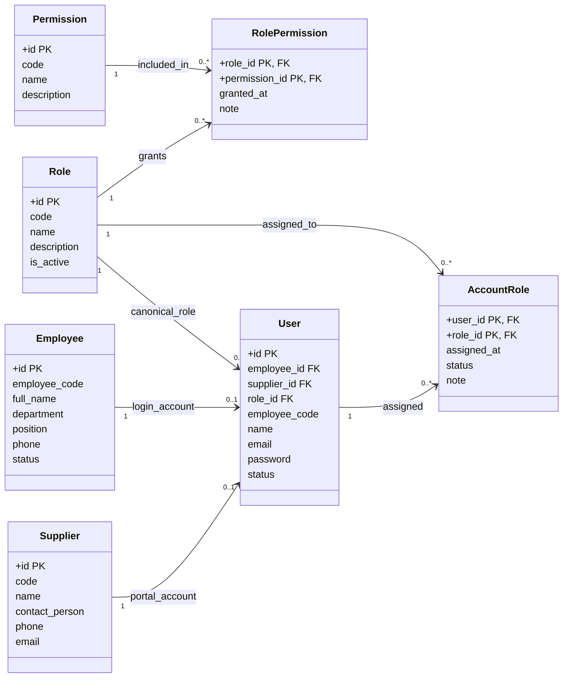
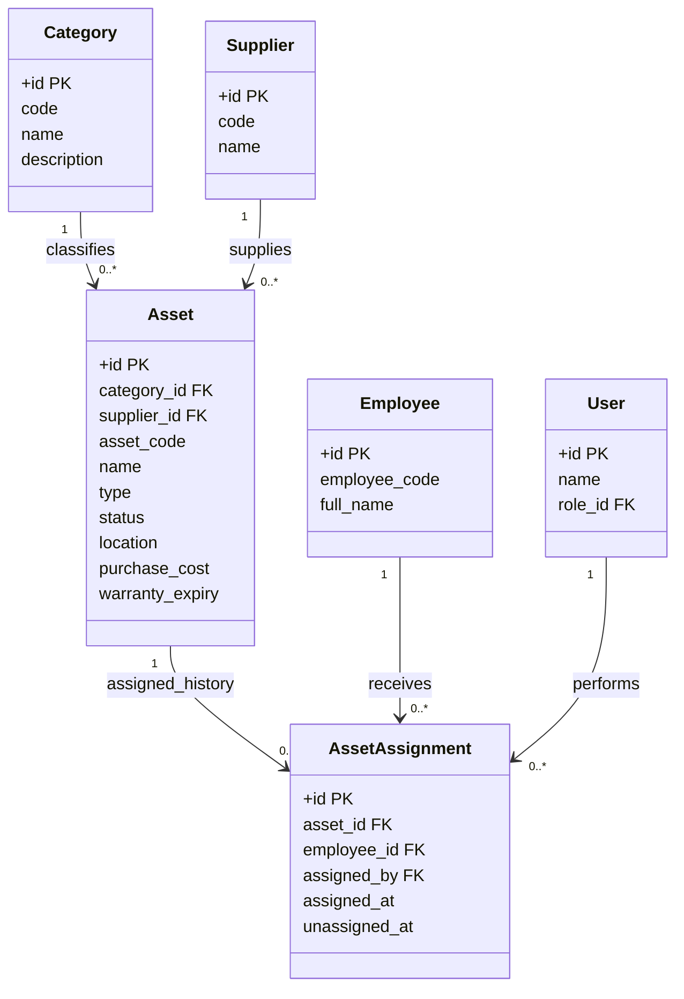
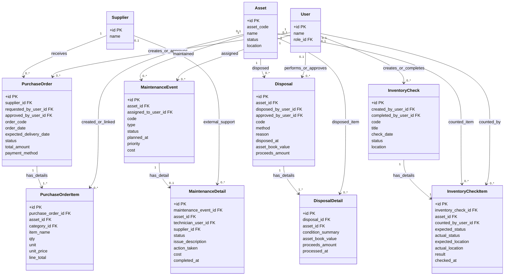

# Class Diagram

Tài liệu này phản ánh scope mới nhất theo yêu cầu khách hàng: phần tài khoản/quyền có khóa chính và khóa ngoại rõ ràng; phần nghiệp vụ chính gồm 4 luồng có bảng chính và bảng chi tiết.

## 1. Tài khoản và phân quyền

## 2. Danh mục tài sản

## 3. Bốn nghiệp vụ chính

## Ghi chú đọc sơ đồ

- `PK` là Primary Key, định danh duy nhất của một bản ghi.
- `FK` là Foreign Key, cột dùng để liên kết sang bảng khác.
- `1`, `0..1`, `0..*`, `1..*` lần lượt nghĩa là một, có thể không có hoặc một, có thể nhiều, và ít nhất một.
- Bảng `requests`, `request_items`, `request_events` không còn nằm trong scope hiện tại.
