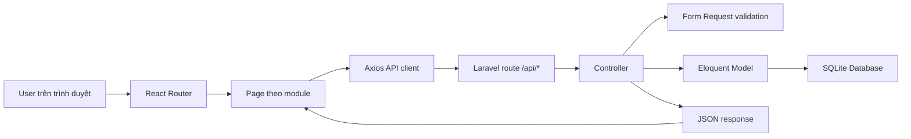

# Stack Và Runtime Flow

`Stack` là bộ công nghệ dùng để xây hệ thống. Dự án này dùng Laravel cho backend, React cho frontend và SQLite cho local/test để dễ chạy trên máy cá nhân.

## Công Nghệ

| Lớp | Công nghệ | Vai trò |
| --- | --- | --- |
| Backend | Laravel 12, PHP 8.2 | API, validation, authentication, business logic |
| Auth | Laravel Sanctum | Đăng nhập và bảo vệ API bằng session/token |
| Frontend | React 19, Vite 7 | SPA UI, route, form, dashboard |
| HTTP client | Axios | Gọi API từ React |
| Database | SQLite local/test | Lưu asset, department, maintenance, inventory, purchase order |
| Test | PHPUnit, npm scripts | Regression backend, build frontend, check i18n |

## Cấu Trúc Repo

| Path | Ý nghĩa |
| --- | --- |
| `app/Models` | Model nghiệp vụ: Asset, MaintenanceEvent, InventoryCheck, PurchaseOrder |
| `app/Http/Controllers` | API controller cho từng module |
| `app/Http/Requests` | Validation request đầu vào |
| `routes/api.php` | Khai báo API và legacy endpoint `410 Gone` |
| `database/migrations` | Lịch sử schema, không rewrite trong cleanup hiện tại |
| `database/seeders` | Demo data theo IT Asset Management |
| `resources/js/pages` | Page React theo module |
| `resources/js/components` | Component dùng chung |
| `resources/js/i18n` | Dịch EN/VI, có script kiểm tra key parity |
| `tests/Feature` | Feature tests cho API và nghiệp vụ |
| `docs` | Tài liệu báo cáo/luận văn |

## Runtime Flow



## Lệnh Phát Triển

```bash
composer install
npm install
php artisan migrate --seed
php artisan serve
npm run dev
```

## Lệnh Kiểm Tra

```bash
npm run check:i18n
npm run build
php artisan test
```

## Ghi Chú Về Compatibility

Schema hiện tại vẫn giữ migration lịch sử. Một số bảng/cột cũ có thể còn tồn tại trong database để tránh phá dữ liệu, nhưng không còn được UI active sử dụng. Nếu muốn xóa vật lý, cần migration riêng và kế hoạch backup.
