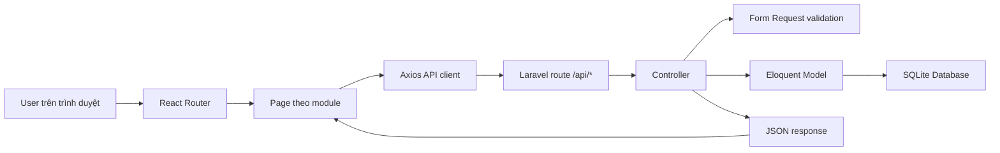
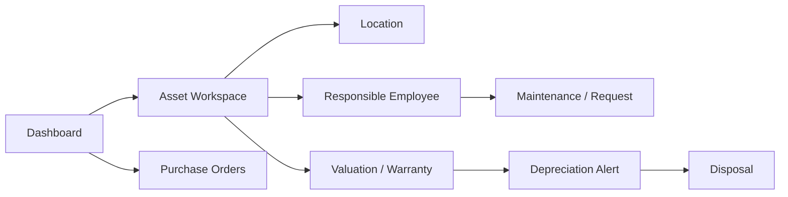

# Stack Và Runtime Flow

`Stack` là bộ công nghệ dùng để xây hệ thống. Dự án này dùng Laravel cho backend, React cho frontend, SQLite cho local/test nhanh và một Docker devpack với MySQL để handoff dễ hơn trên máy Windows.

## Công Nghệ

| Lớp | Công nghệ | Vai trò |
| --- | --- | --- |
| Backend | Laravel 12, PHP 8.2 | API, validation, authentication, business logic |
| Auth | Laravel Sanctum | Đăng nhập bằng `employee_code + password`, bảo vệ API bằng session/token |
| Frontend | React 19, Vite 7 | SPA UI, route, form, dashboard |
| HTTP client | Axios | Gọi API từ React |
| Database | SQLite local/test, MySQL trong Docker | Lưu asset, location, responsible employee history, maintenance, inventory, purchase order |
| Test | PHPUnit, npm scripts | Regression backend, build frontend, check i18n |

## Cấu Trúc Repo

| Path | Ý nghĩa |
| --- | --- |
| `app/Models` | Model nghiệp vụ: Asset, Location, AssetAssignment, MaintenanceEvent, InventoryCheck, PurchaseOrder |
| `app/Http/Controllers` | API controller cho từng module |
| `app/Http/Requests` | Validation request đầu vào |
| `routes/api.php` | Khai báo API và legacy endpoint `410 Gone` |
| `database/migrations` | Lịch sử schema, không rewrite trong cleanup hiện tại |
| `database/seeders` | Demo data theo IT Asset Management |
| `resources/js/pages` | Page React theo module |
| `resources/js/components` | Component dùng chung |
| `resources/js/i18n` | Dịch EN/VI, có script kiểm tra key parity |
| `tests/Feature` | Feature tests cho API và nghiệp vụ |
| `docs` | Tài liệu báo cáo/luận văn |

## Runtime Flow


```mermaid
flowchart LR
    U["User trên trình duyệt"] --> R["React Router"]
    R --> P["Page theo module"]
    P --> A["Axios API client"]
    A --> L["Laravel route /api/*"]
    L --> C["Controller"]
    C --> V["Form Request validation"]
    C --> M["Eloquent Model"]
    M --> D["SQLite Database"]
    C --> J["JSON response"]
    J --> P
```

## Runtime Giao Diện Hiện Tại

- Topbar search điều hướng về `Asset Workspace` với query `q` để tra cứu asset theo mã, danh mục, vị trí hoặc người đang giữ.
- Dashboard manager và technician đọc thêm inventory summary, valuation, maintenance events và approval queue để tạo card tổng quan, chart phân bổ và cảnh báo khấu hao.
- Purchase order page gom thông tin nhà cung cấp, dòng hàng và tổng tiền ngay trong một workspace thay vì form phẳng.

## Business Flow Ngắn


```mermaid
flowchart LR
    A["Dashboard"] --> B["Asset Workspace"]
    B --> C["Location"]
    B --> D["Responsible Employee"]
    D --> E["Maintenance / Request"]
    B --> F["Valuation / Warranty"]
    F --> G["Depreciation Alert"]
    A --> H["Purchase Orders"]
    G --> I["Disposal"]
```

## Lệnh Phát Triển Local

```bash
composer install
npm install
php artisan migrate --seed
php artisan serve
npm run dev
```

## Lệnh Phát Triển Với Docker

```bash
docker compose -f docker/docker-compose.yml up -d --build
docker compose -f docker/docker-compose.yml exec app php artisan migrate --seed
```

- Service `app` dùng `docker/app/entrypoint.sh` để cài dependency, tạo `.env` nếu thiếu và chạy `php -S 0.0.0.0:8000 -t public public/index.php`.
- Service `vite` dùng cùng image và truyền command riêng để chạy HMR trên cổng `5173`.
- Có helper script Windows tại `scripts/docker-setup.bat`, `scripts/docker-start.bat`, `scripts/docker-stop.bat`.

## Lệnh Kiểm Tra

```bash
npm run check:i18n
npm run build
php artisan test
```

## Ghi Chú Về Compatibility

Schema hiện tại vẫn giữ migration lịch sử. Một số bảng/cột cũ có thể còn tồn tại trong database để tránh phá dữ liệu, nhưng không còn được UI active sử dụng. Endpoint legacy ngoài scope active phải trả `410 Gone` với JSON rõ ràng. Nếu muốn xóa vật lý bảng hoặc cột cũ, cần migration riêng và kế hoạch backup.
