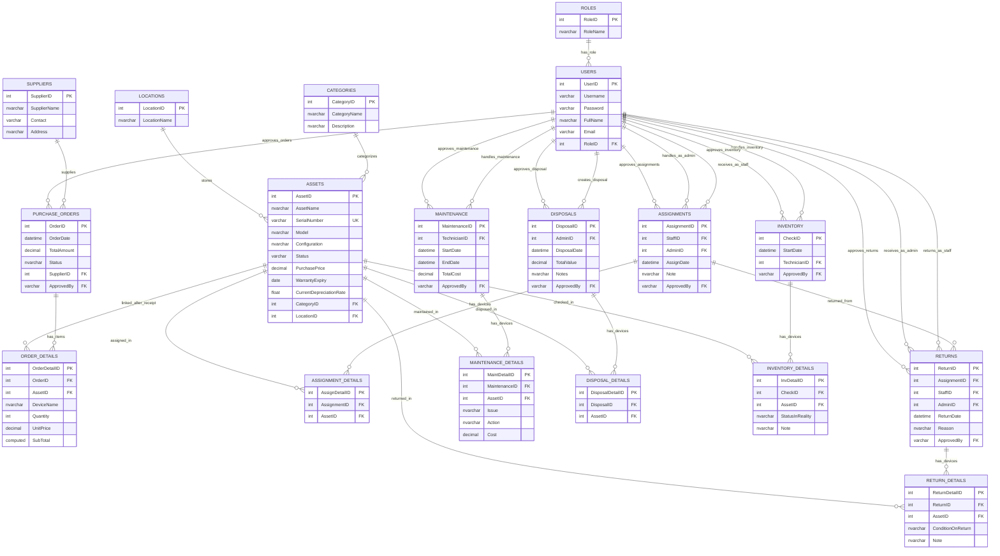

# Trích xuất trường dữ liệu, kiểu dữ liệu và quan hệ để sửa UI

> Phạm vi: trích xuất từ phần thiết kế cơ sở dữ liệu Mesoco, các bảng từ **Roles** đến **InventoryDetails**.
> Quy ước UI: toàn bộ từ **“Tài sản”** trên giao diện nên đổi thành **“Thiết bị”**. Tên bảng/code có thể vẫn giữ `Assets` nếu chưa refactor backend.

---

## 1. Quy ước đặt tên UI tiếng Việt

| Tên kỹ thuật | Tên hiển thị UI nên dùng | Ghi chú |
|---|---|---|
| Asset / Assets | Thiết bị | Không hiển thị “Tài sản” ở UI |
| Category / Categories | Danh mục thiết bị | Tránh dùng “Loại tài sản” |
| Assignment | Phiếu bàn giao | Liên quan đến cấp phát/bàn giao thiết bị |
| Return | Phiếu thu hồi | Thu hồi thiết bị từ nhân viên |
| Maintenance | Phiếu bảo trì | Bảo trì/sửa chữa thiết bị |
| Disposal | Phiếu thu hủy | Thiết bị hết vòng đời/không còn sử dụng |
| Inventory | Phiếu kiểm kê | Kiểm kê thực tế thiết bị |
| Order / PurchaseOrder | Đơn hàng | Đơn mua thiết bị từ nhà cung cấp |
| OrderDetail | Chi tiết đơn hàng | Danh sách thiết bị trong đơn hàng |

---

# 2. Danh sách bảng, tên trường, kiểu dữ liệu và nhãn UI tiếng Việt

## 2.1. Roles — Vai trò

| Trường | Kiểu dữ liệu | Khóa | Nhãn UI tiếng Việt | Mô tả / gợi ý UI |
|---|---:|---|---|---|
| RoleID | INT | PK | Mã vai trò | Tự tăng, không cần nhập thủ công |
| RoleName | NVARCHAR(50) |  | Tên vai trò | Ví dụ: Admin, Staff, Technician |

**UI nên có:** bảng danh sách vai trò, form thêm/sửa vai trò gồm `Tên vai trò`.

---

## 2.2. Users — Người dùng

| Trường | Kiểu dữ liệu | Khóa | Nhãn UI tiếng Việt | Mô tả / gợi ý UI |
|---|---:|---|---|---|
| UserID | INT | PK | Mã người dùng | Mã định danh người dùng |
| Username | VARCHAR(50) | UNIQUE | Tên đăng nhập | Bắt buộc, không trùng |
| Password | VARCHAR(255) |  | Mật khẩu | Lưu mật khẩu đã mã hóa, không hiển thị trực tiếp |
| FullName | NVARCHAR(100) |  | Họ và tên | Hiển thị trên phiếu bàn giao/thu hồi |
| Email | VARCHAR(100) |  | Email | Dùng cho thông báo |
| RoleID | INT | FK → Roles.RoleID | Vai trò | Dropdown chọn vai trò |

**UI nên có:** danh sách người dùng, filter theo vai trò, form thêm/sửa người dùng.

---

## 2.3. Categories — Danh mục thiết bị

| Trường | Kiểu dữ liệu | Khóa | Nhãn UI tiếng Việt | Mô tả / gợi ý UI |
|---|---:|---|---|---|
| CategoryID | INT | PK | Mã danh mục | Tự tăng |
| CategoryName | NVARCHAR(100) |  | Tên danh mục thiết bị | Ví dụ: PC, Màn hình, Thiết bị Test, Phụ kiện dùng, Linh kiện thay thế |
| Description | NVARCHAR(255) |  | Mô tả | Mô tả quy chuẩn/mục đích sử dụng |

**UI nên đổi:** “Loại tài sản” → “Danh mục thiết bị” hoặc “Loại thiết bị”.

---

## 2.4. Assets — Thiết bị

| Trường | Kiểu dữ liệu | Khóa | Nhãn UI tiếng Việt | Mô tả / gợi ý UI |
|---|---:|---|---|---|
| AssetID | INT | PK | Mã thiết bị | Mã định danh nội bộ |
| AssetName | NVARCHAR(100) |  | Tên thiết bị | Ví dụ: Laptop Dell, Màn hình LG |
| SerialNumber | VARCHAR(50) | UNIQUE | Số Serial | Bắt buộc nếu quản lý theo serial |
| Model | NVARCHAR(100) |  | Model | Đời máy/model sản phẩm |
| Configuration | NVARCHAR(255) |  | Cấu hình | CPU, RAM, SSD/HDD, MAC Address, thông số kỹ thuật |
| Status | VARCHAR(20) |  | Trạng thái thiết bị | Nên map sang tiếng Việt ở UI |
| PurchasePrice | DECIMAL(18,2) |  | Giá mua | Định dạng tiền tệ |
| WarrantyExpiry | DATE |  | Ngày hết hạn bảo hành | Date picker |
| CurrentDepreciationRate | FLOAT |  | Tỷ lệ khấu hao hiện tại | Hiển thị dạng phần trăm |
| CategoryID | INT | FK → Categories.CategoryID | Danh mục thiết bị | Dropdown danh mục |
| LocationID | INT | FK → Locations.LocationID | Vị trí | Dropdown vị trí |

### Gợi ý map trạng thái thiết bị

| Giá trị kỹ thuật | Nhãn UI tiếng Việt đề xuất |
|---|---|
| Available | Sẵn sàng |
| Assigned | Đã bàn giao |
| Repairing | Đang bảo trì |
| Disposed | Đã thu hủy |

**Lưu ý UI:** nếu có thêm trạng thái `Đang kiểm kê`, cần bổ sung enum/backend tương ứng hoặc xử lý như trạng thái nghiệp vụ riêng của kiểm kê.

---

## 2.5. Locations — Vị trí

| Trường | Kiểu dữ liệu | Khóa | Nhãn UI tiếng Việt | Mô tả / gợi ý UI |
|---|---:|---|---|---|
| LocationID | INT | PK | Mã vị trí | Nên để auto increment |
| LocationName | NVARCHAR(100) |  | Tên vị trí | Ví dụ: Bàn 1 - Kho tầng 1, Khu HR, Khu kế toán |

**UI nên có:** bảng vị trí gồm `Mã vị trí`, `Tên vị trí`. Nếu UI đang có cột `Mô tả`, cần bổ sung field `Description` vào DB/ERD hoặc bỏ khỏi UI.

---

## 2.6. Suppliers — Nhà cung cấp

| Trường | Kiểu dữ liệu | Khóa | Nhãn UI tiếng Việt | Mô tả / gợi ý UI |
|---|---:|---|---|---|
| SupplierID | INT | PK | Mã nhà cung cấp | Tự tăng hoặc mã hiển thị riêng |
| SupplierName | NVARCHAR(50) |  | Tên nhà cung cấp | Bắt buộc |
| Contact | VARCHAR(50) |  | Thông tin liên hệ | Có thể là số điện thoại hoặc người đại diện |
| Address | NVARCHAR(255) |  | Địa chỉ | Địa chỉ văn phòng/trung tâm bảo hành |

**Lưu ý UI:** nếu form đang có `Email`, `Số điện thoại`, `Người liên hệ`, `Ghi chú` tách riêng thì DB/ERD hiện tại chưa đủ trường. Cần chọn một trong hai hướng:

1. Gộp vào `Contact`; hoặc
2. Bổ sung các field: `ContactPerson`, `Phone`, `Email`, `Note`.

---

## 2.7. PurchaseOrders — Đơn hàng

| Trường | Kiểu dữ liệu | Khóa | Nhãn UI tiếng Việt | Mô tả / gợi ý UI |
|---|---:|---|---|---|
| OrderID | INT | PK | Mã đơn hàng | Tự tăng |
| OrderDate | DATETIME |  | Ngày lập đơn | Mặc định thời gian hiện tại |
| TotalAmount | DECIMAL(18,2) |  | Tổng giá trị đơn hàng | Có thể tính sau khi có đơn giá/thành tiền |
| Status | NVARCHAR(50) |  | Trạng thái đơn hàng | Ví dụ: Chờ duyệt, Đã giao |
| SupplierID | INT | FK → Suppliers.SupplierID | Nhà cung cấp | Dropdown nhà cung cấp |
| ApprovedBy | VARCHAR(20) | FK → Users.UserID theo mô tả | Người phê duyệt | Cần kiểm tra lại kiểu dữ liệu |

**UI tạo đơn hàng giai đoạn hiện tại nên có:**

- Nhà cung cấp
- Danh sách thiết bị đặt mua
- Đơn vị
- Số lượng
- Ghi chú
- Nút thêm/gỡ thiết bị

**Chưa nên bắt buộc ở bước tạo đơn:** đơn giá, thành tiền, phương thức thanh toán.

---

## 2.8. OrderDetails — Chi tiết đơn hàng

| Trường | Kiểu dữ liệu | Khóa | Nhãn UI tiếng Việt | Mô tả / gợi ý UI |
|---|---:|---|---|---|
| OrderDetailID | INT | PK | Mã chi tiết đơn hàng | Tự tăng |
| OrderID | INT | FK → PurchaseOrders.OrderID | Mã đơn hàng | Dòng này thuộc đơn hàng nào |
| AssetID | INT | FK → Assets.AssetID, nullable | Thiết bị liên kết | Có thể để trống lúc mới đặt hàng |
| DeviceName | NVARCHAR(200) |  | Tên thiết bị đặt mua | Tên thiết bị ghi trên đơn |
| Quantity | INT |  | Số lượng | Bắt buộc, số nguyên dương |
| UnitPrice | DECIMAL(18,2) |  | Đơn giá | Có thể nullable nếu nhập sau khi nhận hàng |
| SubTotal | AS (Q*U) | Computed | Thành tiền | Tính từ số lượng × đơn giá |

**Lưu ý logic:** nếu `Quantity > 1`, một `AssetID` trong `OrderDetails` là chưa đủ để đại diện cho nhiều thiết bị vật lý. Nên cân nhắc tạo thiết bị sau khi nhập kho đạt chuẩn.

---

## 2.9. Assignments — Phiếu bàn giao

| Trường | Kiểu dữ liệu | Khóa | Nhãn UI tiếng Việt | Mô tả / gợi ý UI |
|---|---:|---|---|---|
| AssignmentID | INT | PK | Mã phiếu bàn giao | Mã phiếu chính |
| StaffID | INT | FK → Users.UserID | Người nhận | Nhân viên nhận thiết bị |
| AdminID | INT | FK → Users.UserID | Người thực hiện bàn giao | Nhân viên IT/người quản lý thực hiện |
| AssignDate | DATETIME |  | Ngày bàn giao | Mặc định ngày hiện tại |
| Note | NVARCHAR(255) |  | Ghi chú | Ghi chú phiếu bàn giao |
| ApprovedBy | VARCHAR(20) | FK → Users.UserID theo mô tả | Người phê duyệt | Cần kiểm tra lại kiểu dữ liệu |

**UI nên có:** chọn người nhận, chọn người thực hiện, chọn danh sách thiết bị, ghi chú, trạng thái duyệt nếu có workflow duyệt.

---

## 2.10. AssignmentDetails — Chi tiết phiếu bàn giao

| Trường | Kiểu dữ liệu | Khóa | Nhãn UI tiếng Việt | Mô tả / gợi ý UI |
|---|---:|---|---|---|
| AssignDetailID | INT | PK | Mã chi tiết bàn giao | Tự tăng |
| AssignmentID | INT | FK → Assignments.AssignmentID | Mã phiếu bàn giao | Thuộc phiếu bàn giao nào |
| AssetID | INT | FK → Assets.AssetID | Thiết bị bàn giao | Thiết bị cụ thể được bàn giao |

**UI nên hiển thị trong phiếu:** tên thiết bị, serial, model, tình trạng trước khi giao nếu có.

---

## 2.11. Returns — Phiếu thu hồi

| Trường | Kiểu dữ liệu | Khóa | Nhãn UI tiếng Việt | Mô tả / gợi ý UI |
|---|---:|---|---|---|
| ReturnID | INT | PK | Mã phiếu thu hồi | Mã phiếu chính |
| AssignmentID | INT | FK → Assignments.AssignmentID | Phiếu bàn giao liên quan | Đối chiếu giao - thu hồi |
| StaffID | INT | FK → Users.UserID | Người trả thiết bị | Nhân viên trả thiết bị |
| AdminID | INT | FK → Users.UserID | Người nhận lại | Người tiếp nhận thiết bị về kho |
| ReturnDate | DATETIME |  | Ngày thu hồi | Mặc định ngày hiện tại |
| Reason | NVARCHAR(255) |  | Lý do thu hồi | Ví dụ: nghỉ việc, đổi thiết bị, hỏng |
| ApprovedBy | VARCHAR(20) | FK → Users.UserID theo mô tả | Người phê duyệt | Cần kiểm tra lại kiểu dữ liệu |

---

## 2.12. ReturnDetails — Chi tiết thu hồi

| Trường | Kiểu dữ liệu | Khóa | Nhãn UI tiếng Việt | Mô tả / gợi ý UI |
|---|---:|---|---|---|
| ReturnDetailID | INT | PK | Mã chi tiết thu hồi | Tự tăng |
| ReturnID | INT | FK → Returns.ReturnID | Mã phiếu thu hồi | Thuộc phiếu thu hồi nào |
| AssetID | INT | FK → Assets.AssetID | Thiết bị thu hồi | Thiết bị được trả về |
| ConditionOnReturn | NVARCHAR(255) |  | Tình trạng khi thu hồi | Ví dụ: trầy xước, hỏng màn hình |
| Note | NVARCHAR(255) |  | Ghi chú | Ghi chú phát sinh |

---

## 2.13. Maintenance — Phiếu bảo trì

| Trường | Kiểu dữ liệu | Khóa | Nhãn UI tiếng Việt | Mô tả / gợi ý UI |
|---|---:|---|---|---|
| MaintenanceID | INT | PK | Mã phiếu bảo trì | Mã đợt bảo trì |
| TechnicianID | INT | FK → Users.UserID | Kỹ thuật viên phụ trách | Người thực hiện bảo trì |
| StartDate | DATETIME |  | Ngày bắt đầu | Ngày đưa đi bảo trì/sửa chữa |
| EndDate | DATETIME |  | Ngày hoàn thành | Có thể để trống khi chưa hoàn thành |
| TotalCost | DECIMAL(18,2) |  | Tổng chi phí | Tổng chi phí bảo trì |
| ApprovedBy | VARCHAR(20) | FK → Users.UserID theo mô tả | Người phê duyệt | Cần kiểm tra lại kiểu dữ liệu |

---

## 2.14. MaintenanceDetails — Chi tiết bảo trì

| Trường | Kiểu dữ liệu | Khóa | Nhãn UI tiếng Việt | Mô tả / gợi ý UI |
|---|---:|---|---|---|
| MaintDetailID | INT | PK | Mã chi tiết bảo trì | Tự tăng |
| MaintenanceID | INT | FK → Maintenance.MaintenanceID | Mã phiếu bảo trì | Thuộc phiếu bảo trì nào |
| AssetID | INT | FK → Assets.AssetID | Thiết bị bảo trì | Thiết bị được sửa chữa |
| Issue | NVARCHAR(255) |  | Vấn đề/Lỗi | Mô tả lỗi |
| Action | NVARCHAR(255) |  | Cách xử lý | Hành động khắc phục |
| Cost | DECIMAL(18,2) |  | Chi phí | Chi phí riêng cho thiết bị này |

---

## 2.15. Disposals — Phiếu thu hủy

| Trường | Kiểu dữ liệu | Khóa | Nhãn UI tiếng Việt | Mô tả / gợi ý UI |
|---|---:|---|---|---|
| DisposalID | INT | PK | Mã phiếu thu hủy | Mã phiếu chính |
| AdminID | INT | FK → Users.UserID | Người lập phiếu | Người thực hiện thủ tục thu hủy |
| DisposalDate | DATETIME |  | Ngày thu hủy | Ngày chính thức thu hủy/thanh lý |
| TotalValue | DECIMAL(18,2) |  | Giá trị thu hồi | Số tiền thu hồi nếu có |
| Notes | NVARCHAR(255) |  | Ghi chú | Lý do/phương thức thu hủy |
| ApprovedBy | VARCHAR(20) | FK → Users.UserID theo mô tả | Người phê duyệt | Cần kiểm tra lại kiểu dữ liệu |

**UI nên dùng thống nhất:** “Thu hủy” nếu đó là thuật ngữ trong báo cáo. Không trộn “thanh lý” và “thu hủy” nếu không phân biệt nghiệp vụ.

---

## 2.16. DisposalDetails — Chi tiết thu hủy

| Trường | Kiểu dữ liệu | Khóa | Nhãn UI tiếng Việt | Mô tả / gợi ý UI |
|---|---:|---|---|---|
| DisposalDetailID | INT | PK | Mã chi tiết thu hủy | Tự tăng |
| DisposalID | INT | FK → Disposals.DisposalID | Mã phiếu thu hủy | Thuộc phiếu thu hủy nào |
| AssetID | INT | FK → Assets.AssetID | Thiết bị thu hủy | Thiết bị bị loại bỏ khỏi hệ thống |

---

## 2.17. Inventory — Phiếu kiểm kê

| Trường | Kiểu dữ liệu | Khóa | Nhãn UI tiếng Việt | Mô tả / gợi ý UI |
|---|---:|---|---|---|
| CheckID | INT | PK | Mã phiếu kiểm kê | Mã đợt kiểm kê |
| StartDate | DATETIME |  | Ngày bắt đầu kiểm kê | Ngày bắt đầu kiểm kê |
| TechnicianID | INT | FK → Users.UserID | Người phụ trách kiểm kê | Người chịu trách nhiệm chính |
| ApprovedBy | VARCHAR(20) | FK → Users.UserID theo mô tả | Người phê duyệt | Cần kiểm tra lại kiểu dữ liệu |

---

## 2.18. InventoryDetails — Chi tiết kiểm kê

| Trường | Kiểu dữ liệu | Khóa | Nhãn UI tiếng Việt | Mô tả / gợi ý UI |
|---|---:|---|---|---|
| InvDetailID | INT | PK | Mã chi tiết kiểm kê | Tự tăng |
| CheckID | INT | FK → Inventory.CheckID | Mã phiếu kiểm kê | Thuộc đợt kiểm kê nào |
| AssetID | INT | FK → Assets.AssetID | Thiết bị kiểm kê | Thiết bị được kiểm tra |
| StatusInReality | NVARCHAR(100) |  | Tình trạng thực tế | Kết quả kiểm tra thực tế |
| Note | NVARCHAR(255) |  | Ghi chú | Sai lệch/hiện trạng phát sinh |

---

# 3. Quan hệ dữ liệu cần thể hiện trong ERD

## 3.1. Bảng quan hệ chính

| STT | Bảng cha | Bảng con | Khóa ngoại | Quan hệ | Ý nghĩa nghiệp vụ |
|---:|---|---|---|---|---|
| 1 | Roles | Users | Users.RoleID | 1 - N | Một vai trò có nhiều người dùng |
| 2 | Categories | Assets | Assets.CategoryID | 1 - N | Một danh mục có nhiều thiết bị |
| 3 | Locations | Assets | Assets.LocationID | 1 - N | Một vị trí có nhiều thiết bị |
| 4 | Suppliers | PurchaseOrders | PurchaseOrders.SupplierID | 1 - N | Một nhà cung cấp có nhiều đơn hàng |
| 5 | Users | PurchaseOrders | PurchaseOrders.ApprovedBy | 1 - N | Một người dùng có thể phê duyệt nhiều đơn hàng |
| 6 | PurchaseOrders | OrderDetails | OrderDetails.OrderID | 1 - N | Một đơn hàng có nhiều dòng thiết bị |
| 7 | Assets | OrderDetails | OrderDetails.AssetID | 1 - N hoặc nullable | Một thiết bị có thể liên kết chi tiết đơn sau khi nhập kho; cần kiểm tra lại logic nếu số lượng > 1 |
| 8 | Users | Assignments | Assignments.StaffID | 1 - N | Một nhân viên có thể nhận nhiều phiếu bàn giao |
| 9 | Users | Assignments | Assignments.AdminID | 1 - N | Một admin/kỹ thuật viên có thể thực hiện nhiều phiếu bàn giao |
| 10 | Users | Assignments | Assignments.ApprovedBy | 1 - N | Một người dùng có thể phê duyệt nhiều phiếu bàn giao |
| 11 | Assignments | AssignmentDetails | AssignmentDetails.AssignmentID | 1 - N | Một phiếu bàn giao có nhiều thiết bị |
| 12 | Assets | AssignmentDetails | AssignmentDetails.AssetID | 1 - N | Một thiết bị có thể xuất hiện trong lịch sử bàn giao |
| 13 | Assignments | Returns | Returns.AssignmentID | 1 - N | Một phiếu bàn giao có thể phát sinh phiếu thu hồi |
| 14 | Users | Returns | Returns.StaffID | 1 - N | Một nhân viên có thể trả nhiều thiết bị qua nhiều phiếu |
| 15 | Users | Returns | Returns.AdminID | 1 - N | Một admin/kỹ thuật viên có thể nhận lại nhiều phiếu thu hồi |
| 16 | Users | Returns | Returns.ApprovedBy | 1 - N | Một người dùng có thể phê duyệt nhiều phiếu thu hồi |
| 17 | Returns | ReturnDetails | ReturnDetails.ReturnID | 1 - N | Một phiếu thu hồi có nhiều thiết bị |
| 18 | Assets | ReturnDetails | ReturnDetails.AssetID | 1 - N | Một thiết bị có lịch sử thu hồi |
| 19 | Users | Maintenance | Maintenance.TechnicianID | 1 - N | Một kỹ thuật viên có thể phụ trách nhiều phiếu bảo trì |
| 20 | Users | Maintenance | Maintenance.ApprovedBy | 1 - N | Một người dùng có thể phê duyệt nhiều phiếu bảo trì |
| 21 | Maintenance | MaintenanceDetails | MaintenanceDetails.MaintenanceID | 1 - N | Một phiếu bảo trì có nhiều chi tiết thiết bị |
| 22 | Assets | MaintenanceDetails | MaintenanceDetails.AssetID | 1 - N | Một thiết bị có nhiều lần bảo trì |
| 23 | Users | Disposals | Disposals.AdminID | 1 - N | Một admin có thể lập nhiều phiếu thu hủy |
| 24 | Users | Disposals | Disposals.ApprovedBy | 1 - N | Một người dùng có thể phê duyệt nhiều phiếu thu hủy |
| 25 | Disposals | DisposalDetails | DisposalDetails.DisposalID | 1 - N | Một phiếu thu hủy có nhiều thiết bị |
| 26 | Assets | DisposalDetails | DisposalDetails.AssetID | 1 - N | Một thiết bị có thể được ghi nhận trong chi tiết thu hủy |
| 27 | Users | Inventory | Inventory.TechnicianID | 1 - N | Một người dùng có thể phụ trách nhiều đợt kiểm kê |
| 28 | Users | Inventory | Inventory.ApprovedBy | 1 - N | Một người dùng có thể phê duyệt nhiều đợt kiểm kê |
| 29 | Inventory | InventoryDetails | InventoryDetails.CheckID | 1 - N | Một đợt kiểm kê có nhiều thiết bị được kiểm tra |
| 30 | Assets | InventoryDetails | InventoryDetails.AssetID | 1 - N | Một thiết bị có nhiều lần kiểm kê |

---

## 3.2. Mermaid ERD đề xuất



---

# 4. Checklist sửa UI theo database

## 4.1. Sidebar/Menu

- Đổi “Quản lý tài sản” → “Quản lý thiết bị” nếu có.
- Đổi “Danh mục tài sản” → “Danh mục thiết bị”.
- Đổi “Quét QR tài sản” → “Quét QR thiết bị”.
- Đổi “Tài sản” trong tất cả title/breadcrumb/button/table/filter thành “Thiết bị”.

## 4.2. Danh mục thiết bị

Cột nên hiển thị:

- Mã thiết bị
- Tên thiết bị
- Serial
- Model
- Danh mục thiết bị
- Vị trí
- Trạng thái thiết bị
- Tỷ lệ khấu hao
- Ngày hết hạn bảo hành

Filter nên có:

- Tìm kiếm theo tên/serial/model
- Danh mục thiết bị
- Trạng thái thiết bị
- Vị trí

## 4.3. Danh mục vị trí

Theo schema hiện tại chỉ có:

- Mã vị trí
- Tên vị trí

Nếu UI yêu cầu thêm `Mô tả`, cần bổ sung `Description NVARCHAR(255)` vào bảng `Locations`.

## 4.4. Nhà cung cấp

Theo schema hiện tại chỉ có:

- Mã nhà cung cấp
- Tên nhà cung cấp
- Thông tin liên hệ
- Địa chỉ

Nếu UI đang có nhiều field hơn, cần bổ sung schema hoặc gộp field.

## 4.5. Đơn hàng

Form tạo đơn hàng ban đầu nên ưu tiên:

- Nhà cung cấp
- Ngày lập đơn
- Trạng thái đơn hàng
- Danh sách thiết bị đặt mua
- Tên thiết bị
- Số lượng
- Ghi chú nếu bổ sung

Các field `Đơn giá`, `Thành tiền`, `Tổng giá trị` nên để optional/nullable hoặc nhập ở bước nhận hàng sau.

## 4.6. Bàn giao / Thu hồi

Phiếu bàn giao cần:

- Người nhận
- Người thực hiện bàn giao
- Ngày bàn giao
- Người phê duyệt
- Danh sách thiết bị bàn giao
- Ghi chú

Phiếu thu hồi cần:

- Phiếu bàn giao liên quan
- Người trả thiết bị
- Người nhận lại
- Ngày thu hồi
- Lý do thu hồi
- Tình trạng khi thu hồi
- Ghi chú

## 4.7. Bảo trì

Phiếu bảo trì cần:

- Kỹ thuật viên phụ trách
- Ngày bắt đầu
- Ngày hoàn thành
- Tổng chi phí
- Người phê duyệt
- Danh sách thiết bị bảo trì
- Lỗi/vấn đề
- Cách xử lý
- Chi phí từng thiết bị

## 4.8. Kiểm kê

Phiếu kiểm kê cần:

- Ngày bắt đầu kiểm kê
- Người phụ trách kiểm kê
- Người phê duyệt
- Danh sách thiết bị kiểm kê
- Tình trạng thực tế
- Ghi chú sai lệch

---

# 5. Điểm cần kiểm tra/sửa lại trước khi giao cho AI code UI

## 5.1. Kiểu dữ liệu `ApprovedBy` chưa nhất quán

Nhiều bảng mô tả `ApprovedBy` là khóa ngoại đến `Users`, nhưng kiểu dữ liệu lại là `VARCHAR(20)` trong khi `Users.UserID` là `INT`.

Các bảng bị ảnh hưởng:

- PurchaseOrders.ApprovedBy
- Assignments.ApprovedBy
- Returns.ApprovedBy
- Maintenance.ApprovedBy
- Disposals.ApprovedBy
- Inventory.ApprovedBy

**Đề xuất:** đổi `ApprovedBy` thành `INT` nếu tham chiếu đến `Users.UserID`.

## 5.2. Bảng Locations thiếu `Description` nếu UI cần cột Mô tả

Schema hiện tại chỉ có:

- LocationID
- LocationName

Nếu UI bắt buộc có cột `Mô tả`, cần thêm:

```sql
Description NVARCHAR(255) NULL
```

## 5.3. Bảng Suppliers thiếu field nếu muốn form chi tiết

Schema hiện tại có `Contact` dạng gộp. Nếu UI muốn tách riêng, cần thêm:

```sql
ContactPerson NVARCHAR(100) NULL
Phone VARCHAR(20) NULL
Email VARCHAR(100) NULL
Note NVARCHAR(255) NULL
```

## 5.4. OrderDetails.AssetID chưa hợp lý nếu đặt nhiều thiết bị cùng loại

Vì một dòng đơn hàng có `Quantity`, nhưng chỉ có một `AssetID`, nên nếu đặt 10 laptop thì không thể map trực tiếp 10 thiết bị vật lý vào một `AssetID`.

**Đề xuất nghiệp vụ:**

- Khi tạo đơn: lưu `DeviceName`, `Quantity`, chưa cần `AssetID`.
- Khi giao hàng đạt kiểm tra: tạo nhiều bản ghi `Assets` tương ứng số lượng thực nhập.
- Nếu cần trace nguồn nhập, thêm bảng nhận hàng hoặc thêm `OrderDetailID` trong bảng `Assets`.

## 5.5. Trạng thái thiết bị cần thống nhất

Schema hiện tại dùng:

- Available
- Assigned
- Repairing
- Disposed

UI đề xuất đang dùng:

- Sẵn sàng
- Đã bàn giao
- Đang bảo trì
- Đang kiểm kê
- Đã thu hủy

Cần bổ sung/mapping rõ `Đang kiểm kê` nếu trạng thái này xuất hiện trên UI.

---

# 6. Prompt ngắn cho AI Agent sửa UI theo file này

```md
Hãy đọc file markdown này và sửa UI theo đúng tên trường, kiểu dữ liệu, nhãn tiếng Việt và quan hệ dữ liệu đã trích xuất.

Yêu cầu chính:
1. Trên UI, đổi toàn bộ “Tài sản” thành “Thiết bị”.
2. Form/table/filter phải dùng đúng nhãn tiếng Việt trong bảng mapping.
3. Không tạo field UI không có trong DB, trừ khi đã thêm migration/schema tương ứng.
4. Kiểm tra các quan hệ FK trước khi sửa form dropdown.
5. Với các field FK, UI phải dùng dropdown/search select lấy từ bảng cha tương ứng.
6. Với `ApprovedBy`, kiểm tra lại kiểu dữ liệu vì hiện schema đang mô tả FK đến Users nhưng type là VARCHAR(20), trong khi UserID là INT.
7. Với `Locations`, nếu UI cần cột Mô tả thì thêm field Description vào DB/ERD hoặc bỏ cột đó khỏi UI.
8. Với `Suppliers`, nếu UI cần Email/Số điện thoại/Người liên hệ/Ghi chú riêng thì thêm field vào DB/ERD hoặc gộp vào Contact.
9. Với đơn hàng, không bắt buộc nhập đơn giá/thành tiền/phương thức thanh toán ở bước tạo đơn nếu nghiệp vụ yêu cầu nhập sau khi nhận hàng đạt.
10. Sau khi sửa, hãy báo cáo file đã sửa, field UI đã đổi, enum/status đã chỉnh và các migration/schema cần cập nhật.
```
